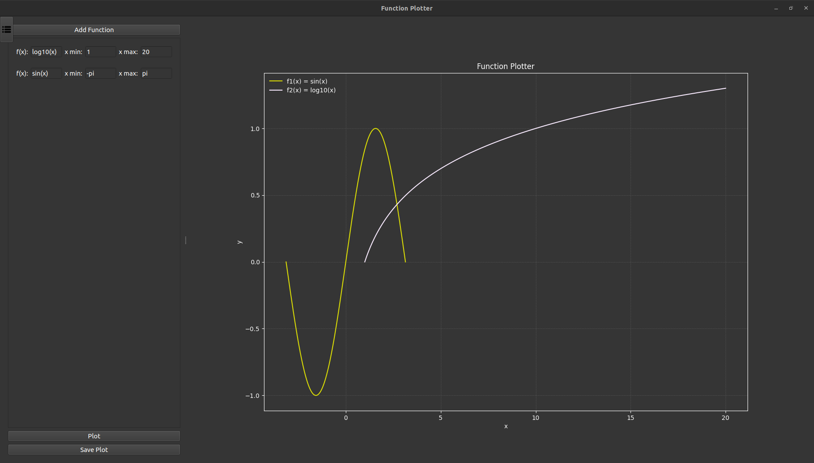

<!-- PROJECT LOGO -->

<h1 align="center"> MashaGebra 📈 </h1>

<!-- Ensure the path to the image is correct -->

 MashaGebra Plotter is a Python-based graphing application built with PySide2 and Matplotlib, designed to provide users with an intuitive interface for visualizing mathematical functions with customizable x-axis ranges.

<a style="text-decoration:none">
 &nbsp;

&nbsp;
&nbsp;
&nbsp;

## Interface

The MashaGebra Plotter features a clean, intuitive interface with a dark theme for comfortable viewing:

The interface consists of:
- A left panel for inputting functions and range values
- A right panel displaying the plotted functions
- A toggle button to show/hide the left panel
- Buttons for adding functions, plotting, and saving the graph

## Features

- Plot multiple functions simultaneously
- Customizable x-axis range for each function
- Dark theme for reduced eye strain
- Zoom and pan functionality for detailed graph exploration
- Save plotted graphs as PNG files
- Input validation to prevent errors
- Support for common mathematical functions (sin, cos, tan, exp, sqrt, log10, abs)

## Working Example

Here's an example of how to use MashaGebra Plotter:

1. Click "Add Function" to create a new function input.
2. Enter the function "log10(x^2) + sqrt(abs(x))" in the f(x) field.
3. Set x min to "1" and x max to "10".
4. Click "Plot" to visualize the function.

## Error Example

Here's an example that would result in an error:

1. Click "Add Function" to create a new function input.
2. Enter the function "1/x" in the f(x) field.
3. Set x min to "-1" and x max to "1".
4. Click "Plot".

This will result in an error message because the function 1/x is undefined at x=0, which is within the specified range.

## Function Plotter Script Explanation

The `function_plotter.py` script is the main component of MashaGebra Plotter. Here's a breakdown of its key components:

1. **Utility Functions**: 
   - `safe_eval`: Safely evaluates mathematical expressions.
   - `parse_and_evaluate`: Parses and evaluates functions over a given range.

2. **GUI Components**:
   - `FunctionInput`: A widget for inputting function and range values.
   - `FunctionPlotter`: The main window of the application.

3. **UI Setup**:
   - `setup_ui`: Sets up the main user interface.
   - `setup_left_panel`: Creates the input panel.
   - `setup_right_panel`: Sets up the plotting area.
   - `setup_toggle_button`: Creates the panel toggle button.
   - `setup_dark_theme`: Applies the dark theme to the application.

4. **Event Handlers**:
   - Handle button clicks, mouse events for zooming and panning, and window resizing.

5. **Core Functionality**:
   - `add_function_input`: Adds new function input fields.
   - `validate_input`: Validates user input.
   - `plot_functions`: Plots the entered functions.
   - `save_plot`: Saves the current plot as an image file.

The script uses PySide2 for the GUI and Matplotlib for plotting, providing a seamless integration of these libraries to create an interactive function plotting application.

## Testing Script Explanation

The `test_function_plotter.py` script contains automated tests for MashaGebra Plotter using pytest and pytest-qt. Here's an overview of the test suite:

1. **Fixtures**:
   - `app`: Creates a QApplication instance for testing.
   - `window`: Creates an instance of FunctionPlotter for each test.

2. **UI Tests**:
   - Test the initial state of the application.
   - Verify the existence and functionality of key UI elements.

3. **Functionality Tests**:
   - Test the `safe_eval` and `parse_and_evaluate` functions.
   - Test plotting of valid functions.
   - Test error handling for invalid inputs.

4. **Integration Tests**:
   - Test adding multiple functions and plotting them together.
   - Test the save plot functionality.

These tests ensure that the application behaves correctly under various scenarios, from basic UI interactions to complex function plotting. They help maintain the reliability and functionality of MashaGebra Plotter as the project evolves.

To run the tests, use the command `pytest test_function_plotter.py` in the project directory.
